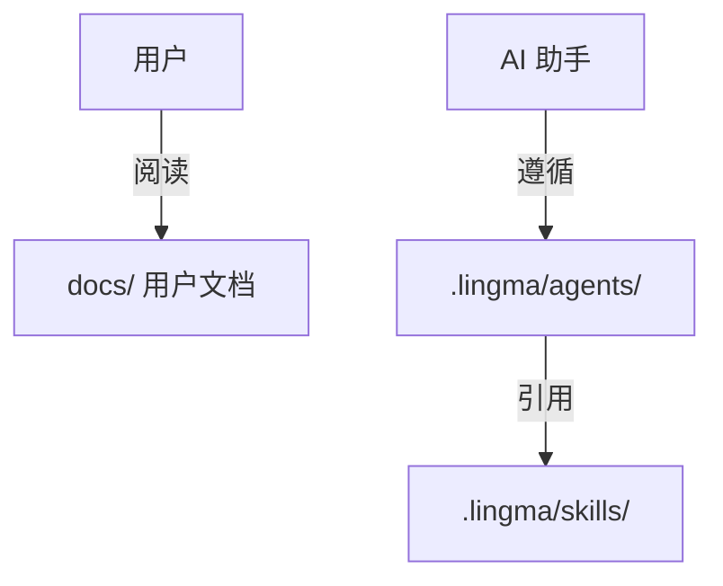

# .lingma/ 目录说明

**重要：** 本目录是 AI 助手的内部配置，普通用户无需查看或修改。

---

## 📂 目录结构

```text
.lingma/
├── README.md                      # 本说明文件
├── agents/                        # AI 角色定义
│   ├── git-commit-agent.md        # Git 提交信息生成助手
│   └── markdown-agent.md          # Markdown 文档生成助手
└── skills/                        # AI 技能规范
    ├── git-commit-format.md       # Git 提交格式详细规范
    └── markdown-format-spec.md    # Markdown 格式详细规范
```

---

## 🤖 这是什么？

`.lingma/` 目录包含 AI 助手的配置文件，用于：

- **定义 AI 角色** - `agents/` 目录告诉 AI"我是谁，我做什么"
- **提供技能规范** - `skills/` 目录告诉 AI"具体怎么做，标准是什么"

**类比：**

- `.vscode/` - VSCode 编辑器的配置
- `.github/` - GitHub 平台的配置
- `.lingma/` - Lingma AI 助手的配置

---

## 📚 用户文档在哪里？

**用户文档位于 `docs/` 目录：**

```text
docs/
├── README.md                      # 文档总索引
├── CUBEMX_GUIDE.md               # CubeMX 集成指南
└── git-commit/                   # Git 提交规范
    ├── spec.md                   # 详细规范
    ├── guide.md                  # 使用指南
    └── quick-reference.md        # 速查卡
```

---

## 🔗 引用关系



**说明：**

- **用户** → 阅读 `docs/` 目录的文档
- **AI 助手** → 遵循 `.lingma/` 目录的配置
- **两者独立** → 互不干扰，职责分离

---

## ⚠️ 重要提示

1. **普通用户** - 请勿修改本目录文件
2. **文档查找** - 用户文档请在 `docs/` 目录查找
3. **AI 配置** - 本目录由 AI 助手自动维护

---

## 📞 需要帮助？

- **使用问题** → 查看 `docs/README.md`
- **Git 提交** → 查看 `docs/git-commit/guide.md`
- **CubeMX 集成** → 查看 `docs/CUBEMX_GUIDE.md`
- **故障排除** → 查看 `TROUBLESHOOTING.md`

---

**最后更新：** 2026-03-17  
**维护状态：** ✅ 活跃
