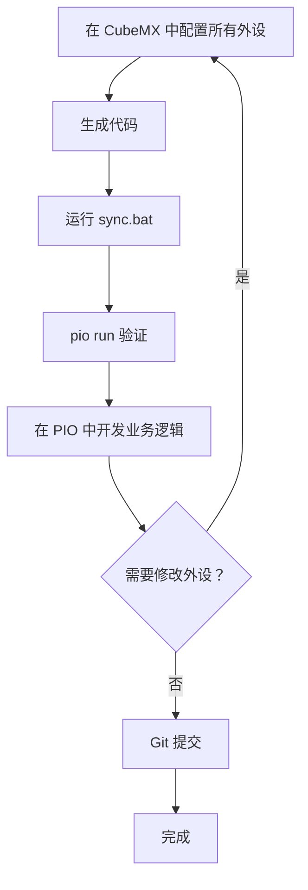

# CubeMX 与 PlatformIO 集成完整指南

**版本：** v1.1.0  
**最后更新：** 2026-03-17

---

## 📋 目录

1. [快速开始](#-快速开始)
2. [CubeMX 配置](#-cubemx-配置)
3. [自动化同步](#-自动化同步)
4. [文件复制规范](#-文件复制规范)
5. [main.c 合并策略](#-mainc-合并策略)
6. [最佳实践](#-最佳实践)
7. [常见问题](#-常见问题)

---

## 🚀 快速开始

### 30 秒快速上手

```bash
# 1. 在 CubeMX 中配置外设 → 选择 Makefile 工具链 → 生成代码
# 2. 在项目根目录双击运行
sync.bat
# 3. 选择 1: 标准模式
# 4. 验证编译
pio run
```

### 一句话答案

**CubeMX 选择 `Makefile` 工具链，只复制 `Core/Inc` 和 `Core/Src` 到 PIO 的 `include/` 和 `src/`，使用 `sync.bat` 自动同步。**

---

## 🎯 CubeMX 配置

### Q1: 在 CubeMX 中应该选择哪种工具链？

**答：选择 `Makefile`**

**原因：**

- ✅ 最接近 PlatformIO 的构建方式
- ✅ 不生成 IDE 特定文件（如 MDK-ARM 的.uvprojx）
- ✅ 代码结构清晰，便于提取
- ✅ 不会生成多余的文件

### Q2: 需要复制哪些文件？

**答：只需复制 `Core/` 目录下的必要文件**

```text
需要复制：                    不需要复制：
├── Core/Inc/             ✗   Drivers/          (PIO 自动管理)
│   ├── *.h               ✗   Makefile          (PIO 有自己的构建系统)
│   └── main.h            ✗   .mxproject        (CubeMX 配置文件)
├── Core/Src/             ✗   startup_*.s       (PIO 自动处理)
│   ├── stm32f1xx_*.c     ✗   *.ld              (PIO 有自己的链接脚本)
│   └── main.c            ✗   syscalls.c        (PIO 已提供)
│                           ✗   sysmem.c          (PIO 已提供)
```

### Q3: 文件应该放到哪里？

答：放到已有目录，不要新建文件夹

保持 PlatformIO 的标准结构：

```text
PIO_TEST2/
├── src/              ← Core/Src/*.c 复制到这里
├── include/          ← Core/Inc/*.h 复制到这里
├── lib/
├── test/
└── platformio.ini
```

> **注意** 不要创建 `Core/` 或 `Drivers/` 子目录，会破坏 PIO 的构建系统。

---

## 🤖 自动化同步

### 方式 1：双击运行（最简单）

```bash
# 在项目根目录
双击 sync.bat
```

### 方式 2：PowerShell 运行

```bash
.\sync_cubemx_simple.ps1
```

### 方式 3：VSCode 任务

按 `Ctrl+Shift+P` → 输入 "Tasks: Run Task" → 选择 "🔄 Sync CubeMX (标准模式)"

### 核心功能

✅ **自动文件复制** - 从 CubeMX Core/Inc 和 Core/Src 复制必要文件  
✅ **智能路径检测** - 自动识别当前 PIO 项目目录  
✅ **安全备份机制** - 自动备份被覆盖的文件  
✅ **交互式菜单** - 多种操作模式可选  

### 操作模式

1. **标准模式** - 复制文件并创建备份（推荐）
2. **强制模式** - 完全覆盖所有文件
3. **仅备份** - 仅创建备份，不复制文件
4. **同步回 CubeMX** - 将 PIO 修改同步回 CubeMX（高级）
5. **清理备份** - 删除 7 天前的旧备份

---

## 📂 文件复制规范

### ✅ 需要复制的文件

| 源目录 | 目标目录 | 文件 | 说明 |
| ------ | -------- | ---- | ---- |
| `Core/Inc/` | `include/` | `stm32f1xx_hal_conf.h` | HAL 库配置 |
| `Core/Inc/` | `include/` | `stm32f1xx_it.h` | 中断处理头文件 |
| `Core/Inc/` | `include/` | `main.h` | 主程序头文件 |
| `Core/Src/` | `src/` | `stm32f1xx_hal_msp.c` | MSP 初始化 |
| `Core/Src/` | `src/` | `stm32f1xx_it.c` | 中断服务程序 |
| `Core/Src/` | `src/` | `system_stm32f1xx.c` | 系统时钟配置 |
| `Core/Src/` | `src/` | `main.c` | ⚠️ 需要手动合并业务逻辑 |

### ❌ 不需要复制的文件

- `Drivers/` - PlatformIO 自动管理 HAL 库
- `Makefile`, `.mxproject` - 不需要
- `startup_stm32f103xb.s` - PIO 自动处理启动文件
- `STM32F103C8Tx_FLASH.ld` - PIO 有自己的链接脚本
- `syscalls.c`, `sysmem.c` - PIO 已提供

---

## 🔧 main.c 合并策略

### 问题分析

CubeMX 生成的 `main.c` 包含以下结构：

```c
/* USER CODE BEGIN Header */
// 许可证信息
/* USER CODE END Header */

/* Includes */
#include "main.h"

/* USER CODE BEGIN Includes */
// 用户包含
/* USER CODE END Includes */

/* Private variables */
/* USER CODE BEGIN PV */
// 用户变量
/* USER CODE END PV */

/* Private function prototypes */
/* USER CODE BEGIN PFP */
// 用户函数声明
/* USER CODE END PFP */

/* Private user code */
/* USER CODE BEGIN 0 */
// 用户函数实现
/* USER CODE END 0 */

int main(void) {
    /* USER CODE BEGIN 1 */
    // 用户代码
    /* USER CODE END 1 */
    
    HAL_Init();
    SystemClock_Config();
    MX_GPIO_Init();
    
    /* USER CODE BEGIN 2 */
    // 用户初始化
    /* USER CODE END 2 */
    
    while (1) {
        /* USER CODE BEGIN WHILE */
        // 用户主循环
        /* USER CODE END WHILE */
        
        /* USER CODE BEGIN 3 */
        // 用户代码
        /* USER CODE END 3 */
    }
}
```

### 脚本的合并策略

**保留的内容：**

- ✅ 所有 `USER CODE BEGIN/END` 块中的代码
- ✅ 你的业务逻辑
- ✅ 自定义函数和变量

**更新的内容：**

- ✅ CubeMX 生成的初始化代码
- ✅ 外设配置
- ✅ 系统时钟配置
- ✅ 中断处理框架

### 操作建议

**脚本会：**

- ✅ 自动备份现有文件到 `src/backup/`
- ⚠️ 复制新版本（**需要手动合并业务逻辑**）

**你应该：**

1. 检查 `src/backup/main.c.*.bak`
2. 复制你的业务逻辑到新生成的文件
3. 在 `USER CODE BEGIN/END` 块内编写代码

---

## 🎓 最佳实践

### 推荐方案：**初始导入 + 手动维护**

#### 工作流程



#### 具体操作

##### 1. 首次配置（一次性）

```bash
# CubeMX 配置所有外设 → 选择 Makefile → 生成代码
# 运行同步脚本
cd D:\Embedded-related\PlatformIO\PIO_TEST2
sync.bat
# 选择 1: 标准模式

# 验证编译
pio run
```

##### 2. 在 PlatformIO 中开发

```c
// src/main.c

/* USER CODE BEGIN Includes */
#include <stdio.h>
#include <string.h>
/* USER CODE END Includes */

/* USER CODE BEGIN PV */
char buffer[100];
/* USER CODE END PV */

/* USER CODE BEGIN 0 */
void LED_Blink(void) {
    HAL_GPIO_TogglePin(GPIOC, GPIO_PIN_13);
}
/* USER CODE END 0 */

int main(void) {
    // ... CubeMX 生成的初始化代码 ...
    
    while (1) {
        /* USER CODE BEGIN WHILE */
        LED_Blink();
        HAL_Delay(500);
        
        sprintf(buffer, "Hello World\n");
        HAL_UART_Transmit(&huart1, (uint8_t*)buffer, strlen(buffer), 100);
        /* USER CODE END WHILE */
    }
}
```

##### 3. 如需修改外设配置

```bash
# 在 CubeMX 中修改 → 重新生成
# 运行同步脚本
sync.bat
# 手动合并 main.c 中的业务逻辑
# 验证编译
pio run
```

##### 4. Git 版本控制

```bash
# 每次同步前提交
git add .
git commit -m "Before CubeMX sync"

# 如有问题可回滚
git reset --hard HEAD~1
```

#### 优点

- ✅ **代码稳定** - 不频繁同步，减少冲突风险
- ✅ **版本可控** - Git 提交清晰
- ✅ **开发高效** - 专注业务逻辑
- ✅ **易于调试** - 问题容易定位

#### 缺点

- ⚠️ 需要手动合并 main.c（但很简单）
- ⚠️ 外设变更需要重新同步

---

## 📊 方案对比

| 方案 | 复杂度 | 风险 | 推荐度 | 适用场景 |
| ---- | ------ | ---- | ------ | -------- |
| 手动复制 | 高 | 中 | ⭐⭐⭐ | 学习阶段 |
| 脚本自动 | 低 | 低 | ⭐⭐⭐⭐⭐ | **推荐** |
| 双向同步 | 高 | 高 | ⭐⭐ | 不推荐 |
| 初始导入 + 手动维护 | 低 | 低 | ⭐⭐⭐⭐⭐ | **最佳实践** |

---

## 🚨 常见问题

### Q1: 同步后编译失败

**可能原因：**

```text
Error: stm32f1xx_hal.h: No such file or directory
```

**解决方案：**

```ini
; platformio.ini
[env:genericSTM32F103C8]
platform = ststm32
board = genericSTM32F103C8
framework = stm32cube

build_flags = 
    -Iinclude
    -DUSE_HAL_DRIVER
    -DSTM32F103xB
```

### Q2: 代码丢失怎么办？

**紧急恢复：**

```bash
# 从备份恢复
Copy-Item src\backup\main.c.*.bak src\main.c -Force

# 或使用 Git
git checkout HEAD -- src/main.c
```

### Q3: 如何合并多次 CubeMX 配置？

**场景：** 配置了 UART 后，又要配置 SPI

**错误做法：**

```bash
# 配置 UART → 同步
# 配置 SPI → 同步（会覆盖 UART 配置）
```

**正确做法：**

```bash
# 在 CubeMX 中同时配置 UART 和 SPI
# 一次性生成
# 运行同步脚本
.\sync.bat
```

### Q4: 可以自动合并 main.c 吗？

**答：** 可以，但有风险

脚本提供了简单的合并功能，但建议：

- ✅ 首次同步使用自动合并
- ⚠️ 后续同步手动检查
- ❌ 复杂业务逻辑不要依赖自动合并

### Q5: 是否需要同步 Drivers？

**答：不需要！**

PlatformIO 通过 `framework-stm32cube` 包自动提供 HAL 库。

```ini
; platformio.ini 会自动处理
platform = ststm32
framework = stm32cube
```

---

## ⚠️ 注意事项

### 1. 脚本必须放在项目根目录

```text
✅ 正确：
PIO_Project/
├── sync.bat
├── sync_cubemx_simple.ps1
├── src/
└── platformio.ini

❌ 错误：
PIO_Project/
├── scripts/
│   └── sync.bat
├── src/
└── platformio.ini
```

### 2. 项目结构必须完整

必须包含：

- ✅ `src/` 目录
- ✅ `platformio.ini` 文件

### 3. 备份管理

**备份位置：**

```text
src/backup/
├── main.c.20260317_135254.bak
├── stm32f1xx_it.c.20260317_135254.bak
└── ...
```

**恢复备份：**

```bash
Copy-Item src\backup\main.c.*.bak src\main.c -Force
```

---

## 🎯 总结

### 核心要点

1. **CubeMX 选择 Makefile** ✅
2. **只复制 Core/Inc 和 Core/Src** ✅
3. **使用 sync.bat 自动同步** ✅
4. **推荐“初始导入 + 手动维护”方案** ✅
5. **使用 Git 版本控制** ✅
6. **在 USER CODE 块内开发业务逻辑** ✅

### 快速参考

- 📖 **快速上手**：本文档
- 📖 **详细说明**：[docs/](docs/) 目录
- 📖 **故障排除**：[TROUBLESHOOTING.md](TROUBLESHOOTING.md)
- 📖 **更新日志**：[CHANGELOG.md](CHANGELOG.md)

---

**祝开发顺利！** 🚀
