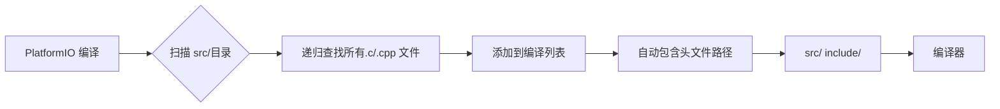

# 传感器驱动开发指南

## 📂 目录结构规范

### 推荐结构（零配置）

```text
src/
├── main.c                          # 程序入口
├── App/                            # 应用层代码
│   ├── sensor_manager.c           # 传感器管理器
│   ├── sensor_manager.h
│   ├── data_processor.c           # 数据处理
│   └── data_processor.h
└── Drivers/                    # 驱动层代码
    ├── Common/                     # 通用驱动接口
    │   ├── i2c_driver.c
    │   ├── i2c_driver.h
    │   ├── spi_driver.c
    │   └── spi_driver.h
    ├── Displays/                   # 显示设备驱动
    │   └── SSD1306/               # OLED 显示屏
    │       ├── ssd1306.c
    │       ├── ssd1306.h
    │       └── README.md
    └── Sensors/                    # 传感器驱动
        ├── Temperature/            # 温度传感器
        │   ├── DS18B20/
        │   │   ├── ds18b20.c
        │   │   ├── ds18b20.h
        │   │   └── README.md      # 使用说明
        │   └── DHT11/
        │       ├── dht11.c
        │       ├── dht11.h
        │       └── README.md
        ├── Motion/                 # 运动传感器
        │   ├── MPU6050/
        │   │   ├── mpu6050.c
        │   │   ├── mpu6050.h
        │   │   └── README.md
        │   └── BMI088/
        │       ├── bmi088.c
        │       ├── bmi088.h
        │       └── README.md
        └── Environmental/          # 环境传感器
            ├── BME280/
            │   ├── bme280.c
            │   ├── bme280.h
            │   └── README.md
            └── SHT30/
                ├── sht30.c
                ├── sht30.h
                └── README.md
```

---

## 🔧 编译配置说明

### ✅ 方案 A：标准结构（推荐）

**使用上述目录结构，无需修改 `platformio.ini`：**

```ini
[env:genericSTM32F103C8]
platform = ststm32
board = genericSTM32F103C8
framework = stm32cube
; ✅ PlatformIO 自动编译 src/ 下所有 .c/.cpp 文件
; ✅ 自动包含 src/ 和 include/ 到头文件路径
```

**在代码中包含头文件：**

```c
// src/main.c
#include "main.h"
#include "Drivers/Sensors/Temperature/DHT11/dht11.h"
#include "App/sensor_manager.h"

int main(void) {
    HAL_Init();
    SystemClock_Config();
    
    // 初始化传感器
    DHT11_Init();
    
    while (1) {
        // 读取传感器数据
        float temp = DHT11_ReadTemperature();
        
        // 应用层处理
        SensorManager_ProcessData(temp);
    }
}
```

---

### ⚠️ 方案 B：自定义根目录结构

**如果要将 `Drivers/` 和 `App/` 放在项目根目录：**

```text
项目根目录/
├── src/
│   └── main.c
├── Drivers/                      # ❗ 需要配置
├── App/                          # ❗ 需要配置
├── include/
└── platformio.ini
```

**必须修改 `platformio.ini`：**

```ini
[env:genericSTM32F103C8]
platform = ststm32
board = genericSTM32F103C8
framework = stm32cube

; ❗ 指定额外的源码目录
extra_src_dirs = 
    ${PROJECT_DIR}/Drivers
    ${PROJECT_DIR}/App

; ❗ 指定额外的头文件路径
build_flags = 
    -I${PROJECT_DIR}/Drivers
    -I${PROJECT_DIR}/App
    -I${PROJECT_DIR}/include
```

---

## 📦 使用现有库 vs 自行开发

### 决策流程

#### 1️⃣ 优先搜索 PlatformIO 库

```bash
# 搜索传感器库
pio lib search "mpu6050"
pio lib search "dht11"
pio lib search "bme280"

# 查看库详情
pio lib show <library_id>

# 安装库
pio lib install "ElectronicCats/MPU6050"
```

**优点：**

- ✅ 经过验证
- ✅ 文档完善
- ✅ 易于维护
- ✅ 自动依赖管理

**检查清单：**

- [ ] 最后更新时间（6 个月内最佳）
- [ ] Star 数量（>50 较可靠）
- [ ] Issue 解决情况
- [ ] 许可证兼容性（MIT/Apache/BSD 友好）
- [ ] 是否支持你的框架（HAL/LL）

---

#### 2️⃣ 何时自行开发？

**适合场景：**

- ❌ PlatformIO 库不存在
- ❌ 库质量差/不维护
- ❌ 需要深度定制
- ❌ 学习目的
- ❌ 特殊硬件接口

**开发步骤：**

1. **创建驱动框架**

```c
// src/Drivers/Sensors/Motion/MPU6050/mpu6050.h
#ifndef __MPU6050_H
#define __MPU6050_H

#include "main.h"

// 传感器配置结构
typedef struct {
    I2C_HandleTypeDef *hi2c;
    uint8_t address;
    float accel_scale;
    float gyro_scale;
} MPU6050_Handle_t;

// 公共接口
HAL_StatusTypeDef MPU6050_Init(MPU6050_Handle_t *hmpu);
HAL_StatusTypeDef MPU6050_ReadAccel(MPU6050_Handle_t *hmpu, float *ax, float *ay, float *az);
HAL_StatusTypeDef MPU6050_ReadGyro(MPU6050_Handle_t *hmpu, float *gx, float *gy, float *gz);

#endif
```

1. **编写实现**

```c
// src/Drivers/Sensors/Motion/MPU6050/mpu6050.c
#include "mpu6050.h"

// MPU6050 寄存器定义
#define MPU6050_ADDR        0x68
#define MPU6050_ACCEL_XOUT  0x3B
#define MPU6050_GYRO_XOUT   0x43

HAL_StatusTypeDef MPU6050_Init(MPU6050_Handle_t *hmpu) {
    // 初始化代码
    return HAL_OK;
}

HAL_StatusTypeDef MPU6050_ReadAccel(MPU6050_Handle_t *hmpu, float *ax, float *ay, float *az) {
    // 读取加速度计数据
    return HAL_OK;
}
```

1. **添加应用层封装**

```c
// src/App/sensor_manager.c
#include "sensor_manager.h"
#include "../Drivers/Sensors/Motion/MPU6050/mpu6050.h"

static MPU6050_Handle_t g_mpu6050;

void SensorManager_Init(void) {
    g_mpu6050.hi2c = &hi2c1;
    g_mpu6050.address = MPU6050_ADDR;
    MPU6050_Init(&g_mpu6050);
}

float SensorManager_GetTemperature(void) {
    // 统一的数据处理接口
    return MPU6050_ReadTemperature(&g_mpu6050);
}
```

---

## 🎯 实际案例对比

### 案例 1：使用现有库（推荐）

```bash
# 安装库
pio lib install "ElectronicCats/MPU6050"
```

```c
// src/main.c
#include <MPU6050_light.h>  // 第三方库

MPU6050 mpu(&Wire);

int main(void) {
    mpu.begin();
    mpu.calcOffsets();
    
    while (1) {
        mpu.update();
        float temp = mpu.getTemp();
    }
}
```

**优势：**

- ✅ 代码量少（10 行 vs 100 行）
- ✅ 可靠性高
- ✅ 文档齐全
- ⏱️ 开发时间：30 分钟

---

### 案例 2：自行开发（学习/定制）

```c
// src/Drivers/Sensors/Motion/MPU6050/mpu6050.c
#include "mpu6050.h"

// 完整的驱动实现（约 200-300 行代码）
// 包括：初始化、配置、数据读取、校准等

HAL_StatusTypeDef MPU6050_Init(MPU6050_Handle_t *hmpu) {
    uint8_t check = 0;
    HAL_I2C_Mem_Read(hmpu->hi2c, hmpu->address, 
                     MPU6050_WHO_AM_I, 1, &check, 1, 100);
    
    if (check != 0x68) return HAL_ERROR;
    
    // 配置陀螺仪、加速度计量程
    // ...
    
    return HAL_OK;
}
```

**优势：**

- ✅ 完全可控
- ✅ 学习价值高
- ✅ 可深度优化
- ⏱️ 开发时间：2-3 天

---

## 📊 编译行为详解

### PlatformIO 如何处理源码？



### 关键规则

| 目录 | 自动识别 | 需要配置 | 推荐用途 |
|------|---------|---------|---------|
| `src/` | ✅ 是 | ❌ 否 | 主程序源码 |
| `include/` | ✅ 是 | ❌ 否 | 公共头文件 |
| `lib/` | ✅ 是 | ❌ 否 | 第三方库 |
| `test/` | ✅ 是 | ❌ 否 | 单元测试 |
| `Drivers/`（根目录） | ❌ 否 | ✅ 是 | 不推荐 |
| `App/`（根目录） | ❌ 否 | ✅ 是 | 不推荐 |

---

## ✅ 最终建议

### 对于您的项目

**采用方案 A（标准结构）：**

1. **保持 `src/` 作为唯一源码目录**
2. **在 `src/` 内部分组：**
   - `src/Drivers/` - 底层驱动
   - `src/App/` - 应用逻辑
   - `src/Utils/` - 工具函数

3. **优先使用 PlatformIO 库：**

```bash
pio lib search "sensor_name"
pio lib install library_name
```

1. **必要时自行开发：**
   - 按类型组织：`Drivers/Sensors/Temperature/`
   - 每个驱动独立目录
   - 提供 README 说明

2. **无需修改 `platformio.ini`**（已在上一步修复 `-IInc` 问题）

---

## 🚀 快速开始模板

我已经为您准备好了标准的目录结构，下一步可以：

1. **创建目录结构**

```bash
mkdir -p src/Drivers/Common
mkdir -p src/Drivers/Sensors/Temperature
mkdir -p src/Drivers/Sensors/Motion
mkdir -p src/App
```

1. **开始开发第一个驱动**

需要我帮您创建具体的传感器驱动模板吗？比如：

- DHT11 温湿度传感器
- MPU6050 六轴传感器
- BME280 气压传感器

请告诉我您想先开发哪个传感器的驱动！🎯
